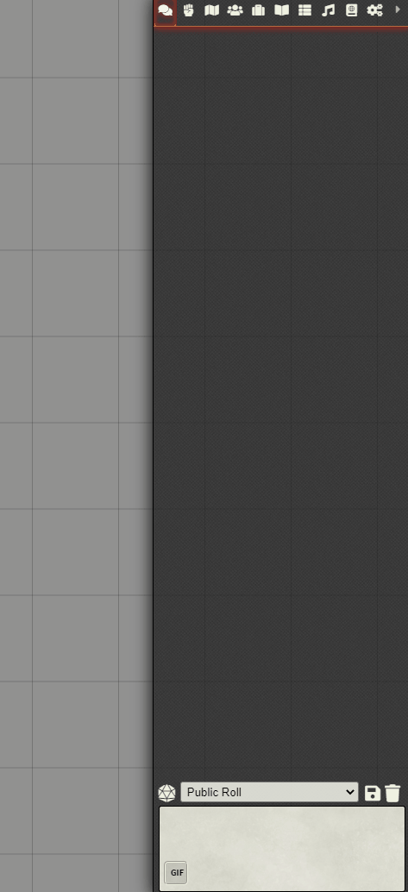

     
# Why?

|  |  |
| --- | --- |
| An image is worth a thousand words, therefore a animated parrot gif must be worth a million . This module is there so your players can react in sessions with the appropriate gif. |  |

# Current Features
 - Adds GIPHY integration for online searching of gifs
 - Ability to edit gif picker background

# Pre Template Development Instructions
You will need to provide to provide a giphy api key that you will insert in the **giphySearchBar.ts** that will be used for your testing purposes which you can get from [Giphy Developers site](https://developers.giphy.com/)

# Development Instructions From the Template:
About Bundler:  
This project uses webpack to bundle your files. What this means is that every script file in src/ will get 'bundled' into one output .js file in dist/.
Likewise every static file (.html, .json, etc.) in static/ will get moved to dist.  
Because of this you should NOT have your development working directory inside the foundryuser folder. Instead you should follow the instructions below
for setting up symantic links between the dist/ folder and foundryuser.

- Run npm install
- Rename module.ts to your chosen module name.
- Rename the references to module.ts in webpack.config.js file. (Line 26)
- Fill in module.json with actual information.
- run: npm run build  
- Create a symantic link between the dist/ folder to a module folder in FoundryUser/Data/modules/[MODULE_NAME]  
--	Instructions (for windows) 
--	Open a command prompt and navigate to FoundryUser/Data/modules   
--	Run: mklink /D MODULE_NAME [DEVELOPMENT_PATH]/dist  

A note on typescript, it is completely optional and if you do not wish to use then rename any .ts files and their references to .js.

# Development Commands:
Development: 
To run with hotswap enabled run the command: npm run start

Release:
To ready the project for release run the command: npm run build:production

# Credits:
BadIdeasBureau, MrPrimate, Calego, Stäbchenfisch, Zeel, Arcanist, LukeAbby, Animu36 and many more from the League of Extraordinary FoundryVTT Developers for all the help and advice   
Giphy for the gif search and collection
